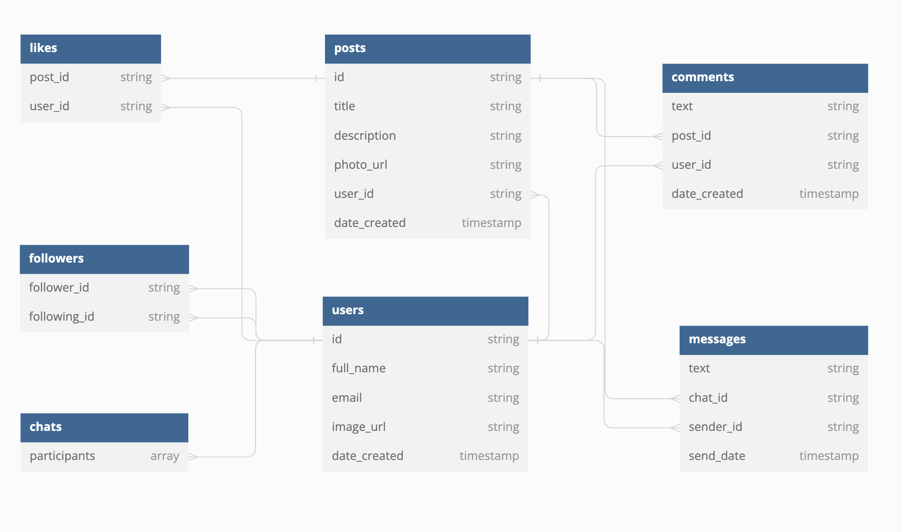

# Explore Me Social Networking App

- [Explore Me Social Networking App](#explore-me-social-networking-app)

  - [What is explore-me?](#what-is-explore-me)
  - [Features overview](#features-overview)
  - [Frameworks & Services](#frameworks-and-services)
    - [Users](#users)
    - [Posts](#posts)
    - [Comments](#comments)
    - [Likes](#likes)
    - [Followers](#followers)
  - [Code organization](#code-organization)
  - [Features in details](#features-in-details)
    - [Feed](#feed)
    - [Posts](#posts)
    - [Comments](#comments)
    - [Chat](#chat)
    - [Profile](#profile)

## What is explore-me?

[...]

## Features overview

- Explore user generated posts
- Manage your posts
- Connect with others by chat
- Comment explored posts
- Like posts
- Follow explored person
- Explore user profiles
- Manage your profile

## Frameworks and Services:

- UIKit
- SwiftUI
- PhotoKit
- Firebase
  - Authentication
  - Firestore (Database)
  - Storage (fot storing files)

### Firestore (Database) Collections

#### users

- full_name
- email
- image_url
- date_created

#### posts

- title
- description
- photo_url
- user_id
- date_created

#### comments

- text
- post_id
- user_id
- date_created

#### likes

- post_id
- user_id

#### followers

- follower_id
- following_id

#### chats

- participants

#### messages

- text
- chat_id
- sender_id
- send_date

### Relationship Between Collections

## Code organization

- Manager Classes - to communicate with backend, sending and receiving data (plain Swift)
- Model Structs - representing data (plain Swift)
- ViewModel Classes - connecting managers and models with views (SwiftUI)
- Views: Scenes & Components - representing user UI, visualizing data (SwiftUI)
- Navigation system (UIKit: UINavigationController, UITabBarController)
- Tables and Collections (UIKit: UITableViewController, UICollectionViewController)
- Project Base (UIKit: AppDelegate, SceneDelegate)

## Features in details

[...]

### Feed

[...]

### Posts

[...]

### Comments

[...]

### Chat

[...]

### Profile

[...]
